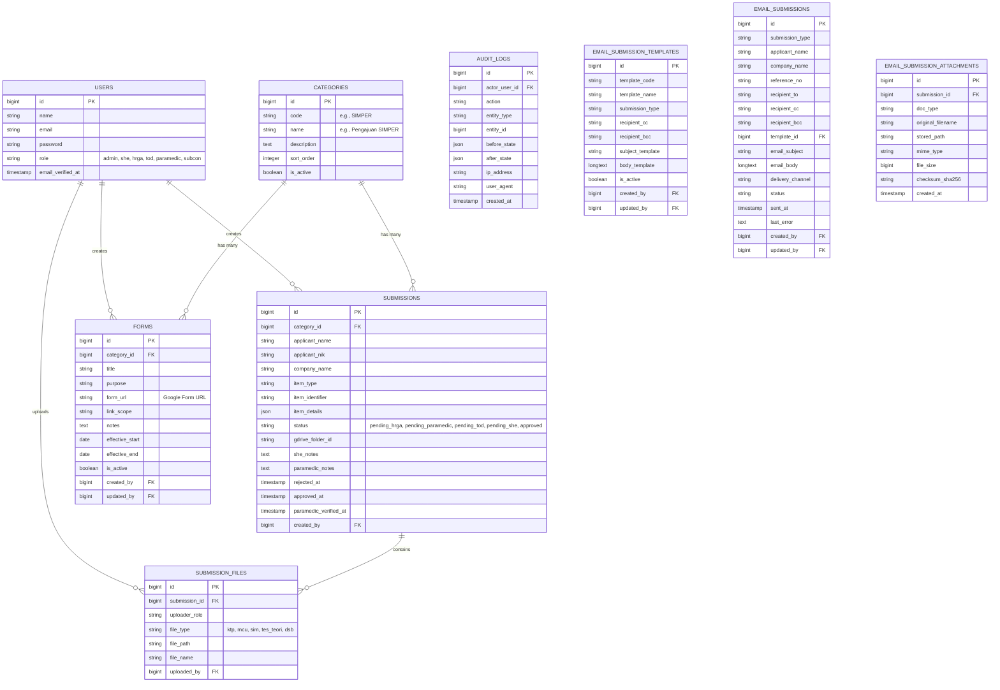

# Entity-Relationship Diagram (ERD)
# Mine Permit & Safety Portal

Dokumen ini menjelaskan struktur relasional database yang digunakan pada sistem **Mine Permit & Safety Portal**. Diagram berikut menampilkan entitas inti, sedangkan tabel operasional pendukung dijelaskan setelah diagram agar dokumentasi tetap ringkas dan mudah divalidasi.

## Diagram ERD

## Deskripsi Tabel Utama

*   **`users`**: Menyimpan data autentikasi dan peran (*Role-Based Access Control*). Peran yang dipakai pada implementasi saat ini adalah `admin`, `she`, `hrga`, `tod`, `paramedic`, dan `subcon`.
*   **`categories`**: Tabel *master* yang mendefinisikan jenis pengajuan atau layanan di portal, termasuk kategori SIMPER, pengajuan internal, dan monitoring turunan.
*   **`forms`**: Menyimpan *link* formulir eksternal yang dipetakan ke kategori tertentu, beserta tujuan formulir (`pengajuan` atau `monitoring`) dan masa aktifnya.
*   **`submissions`**: Tabel inti transaksional yang mencatat setiap pengajuan, status verifikasi *multi-stage*, catatan peninjau, penanda waktu penolakan/persetujuan, serta *folder ID* Google Drive terkait.
*   **`submission_files`**: Menyimpan riwayat berkas yang diunggah untuk setiap pengajuan, dikelompokkan berdasarkan jenis file (`file_type`) dan peran pengunggah (`uploader_role`).
*   **`audit_logs`**: Menyimpan jejak perubahan penting seperti persetujuan, penolakan, perubahan master data, dan aktivitas administrasi lain yang memerlukan pelacakan forensik.
*   **`auth_login_attempts`**: Menyimpan hitungan percobaan login dan masa *lockout* untuk mendukung pembatasan percobaan masuk yang gagal.
*   **`email_submission_templates`**, **`email_submissions`**, dan **`email_submission_attachments`**: Menyimpan template email, data pengiriman, serta lampiran untuk workflow email SIMPER yang dikelola admin.

## Entitas Pendukung Operasional

Selain tabel inti di atas, migrasi juga menyediakan tabel referensi untuk kebutuhan operasional dan penyelarasan data kategori, yaitu `internal_company_groups`, `internal_companies`, `required_documents`, `sapkon_companies`, dan `sapkon_form_buckets`. Tabel-tabel ini dipakai untuk memastikan data form, perusahaan internal, dan dokumen yang dipersyaratkan tetap konsisten dengan proses bisnis yang berjalan.
