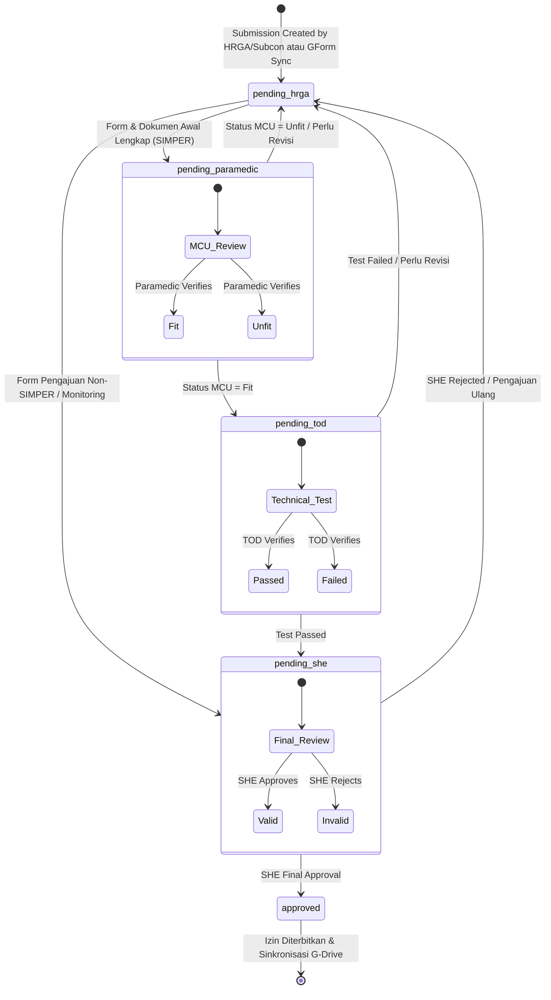

# Workflow & State Diagram
# Mine Permit & Safety Portal

Dokumen ini mengilustrasikan perubahan status (*state machine*) dari sebuah entitas `Submission` di dalam sistem.

## Alur Persetujuan (Approval Workflow)

Setiap pengajuan izin memiliki *lifecycle* yang ketat dan berurutan untuk menjamin akuntabilitas.

## Deskripsi Status (State)

*   **`pending_hrga`**: Tahap awal atau tahap revisi. HRGA/Subcon melengkapi data pekerja, dokumen dasar, atau memperbaiki pengajuan yang dikembalikan dari tahap verifikasi sebelumnya.
*   **`pending_paramedic`**: Berkas telah masuk untuk verifikasi MCU. Tim Paramedic memeriksa kelayakan kesehatan dan menambahkan catatan medis.
*   **`pending_tod`**: Status lolos MCU. Tim TOD mengunggah hasil tes teori/praktek dan melengkapi penilaian teknis.
*   **`pending_she`**: Status lolos TOD atau kategori tertentu yang langsung masuk ke tahap SHE. Berkas siap untuk review final oleh SHE/KTT.
*   **`approved`**: Pengajuan disetujui penuh. Sistem menyimpan hasil persetujuan, menautkan berkas ke Google Drive, dan menyiapkan notifikasi email.

Penolakan pada tahap Paramedic, TOD, atau SHE tidak menjadi state akhir; status dikembalikan ke `pending_hrga` agar pengajuan dapat diperbaiki. Timestamp `rejected_at` tetap dicatat untuk audit.
